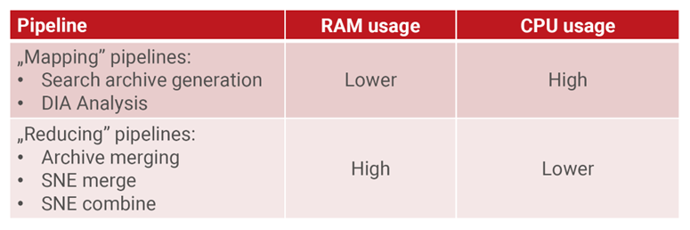
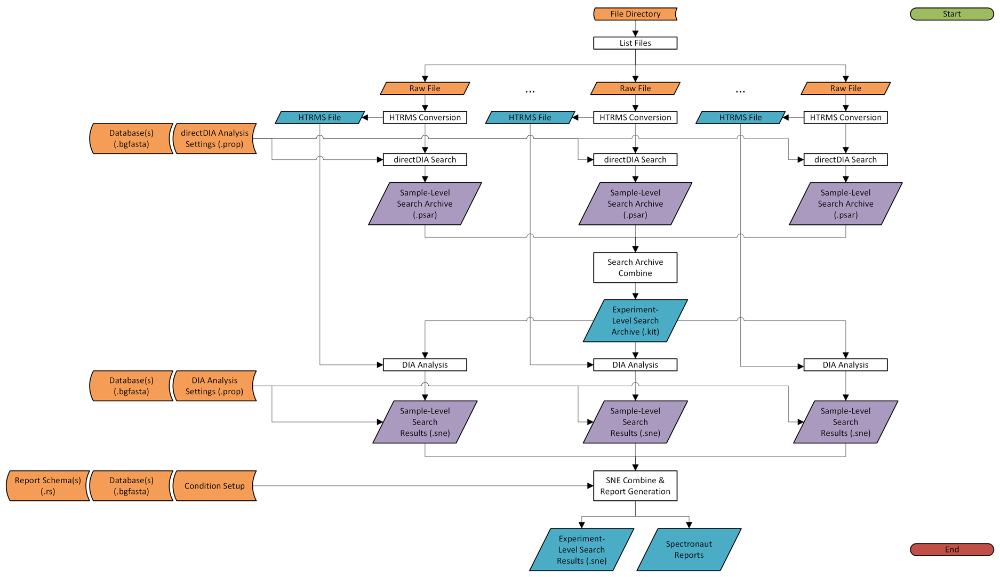
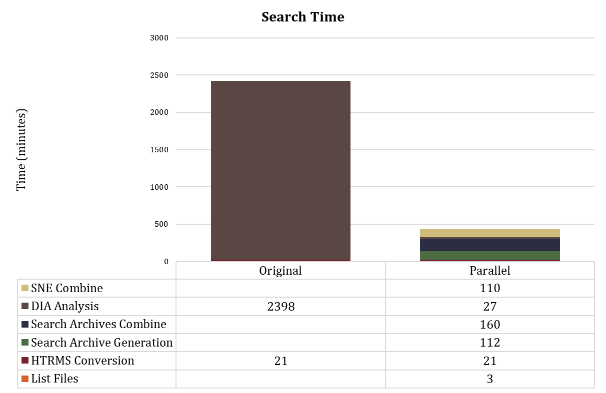
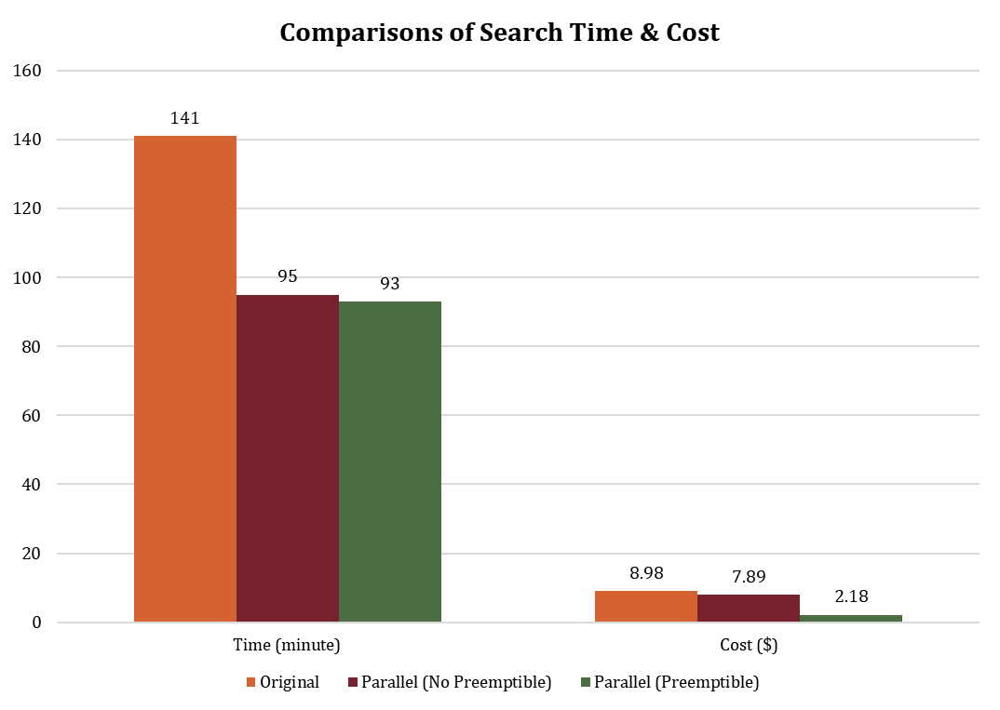

# Parallel Spectronaut Search Workflow

This workflow parallelizes Spectronaut searches by processing each data file in its own Google Cloud instance, reducing total runtime drastically for large-scale proteomics experiments at the same cost. 

## Features

- **Parallel execution**: Each input raw file undergoes HTRMS conversion, search archive generation, and finally DIA analysis in parallel across independent VMs, eliminating sequential processing bottlenecks

### Enhanced User Experience  

- **Full pipeline orchestration**: Seamlessly chains HTRMS conversion → directDIA search → library merging → DIA analysis → SNE combination without manual intervention

- **Experiment-type presets**: Configures CPU, memory, and disk multipliers based on user's input experiment type

  - CPU and memory are configured differently for each task to accommodate their relative resource requirements

  
  
  - **Proteome presets**
    - directDIA: 80 CPU cores, 256 GB RAM
    - Archive Combine: 16 CPU cores, 384 GB RAM
    - DIA Analysis: 32 CPU cores, 128 GB RAM
    - SNE Combine: 16 CPU cores, 384 GB RAM
    - Disk size multiplier: 15x
  - **PTM presets**
    - directDIA: 128 CPU cores, 512 GB RAM
    - Archive Combine: 16 CPU cores, 640 GB RAM
    - DIA Analysis: 64 CPU cores, 256 GB RAM
    - SNE Combine: 16 CPU cores, 640 GB RAM
    - Disk size multiplier: 20x

- **Dynamic disk sizing**: Disk sizes are automatically calculated based on actual input data sizes, preventing insufficient disk size failures while eliminate over-provisioning cost 

### Technical Advantages

- **Preemptible instance support**: Optional use of preemptible VMs for cost reduction (configurable via `n_preemptible`)
- **Checkpoint recovery**: Failed jobs can resume from the point of failure without re-running completed tasks

- **Robust event logging and error handling**: Tracks all task executions in the job log and validates outputs at critical steps with diagnostic error messages  

## Workflow Overview

### 1. File Discovery (`list_files`)
Enumerates all files in the provided GCS directory (`file_directory`), generating a manifest of input files to process.

### 2. Parallel HTRMS Conversion (`htrms_conversion` scatter)
Each raw file is converted to HTRMS format in its own VM instance:
- **Input**: Raw vendor format files (e.g., .raw, .wiff, .d)
- **Schema**: Optional custom conversion schema (`convert_schema`)
- **Output**: Converted .htrms files with preserved base filenames
- **Resources**: 16 CPU, 32 GB RAM, 500 GB disk per file

### 3. Parallel Search Archive Generation via directDIA (`directDIA_search` scatter)
Each HTRMS file undergoes directDIA search to generate an individual search archive:
- **Input**: HTRMS files from step 2
  - `directDIA_settings` is applied at this step

- **Output**: .psar search archive files (one per input)
- **Disk**: 1000 GB SSD per instance
  - *Search archive generation is typically the most time-consuming step in the entire workflow, using SSD storage is recommended to optimize I/O performance*

### 4. File Size Calculation (`calculate_files_size`)
Computes total size of all HTRMS files to determine disk requirements for subsequent operations.

### 5. Library Merging (`combine_archives`)
Merges all individual search archives into a single unified spectral library:
- **Input**: All .psar files from step 3
- **Output**: Single merged_library.kit file
- **Disk**: Dynamic sizing = total HTRMS file size × disk size multiplier

### 6. Parallel DIA Analysis (`dia_analysis` scatter)
Each HTRMS file is re-analyzed against the merged library for final quantification:
- **Input**: HTRMS files from step 2 + merged library from step 5
  - `DIA_analysis_settings` is applied at this step

- **Output**: .sne files containing quantification results
- **Disk**: Fixed 1000 GB HDD per instance

### 7. SNE Merging and Reporting (`combine_sne`)
Combines all individual SNE files and generates final reports:
- **Input**: All .sne files from step 6
- **Output**: spectronaut_output.zip containing merged results and reports
- **Disk**: Dynamic sizing = total HTRMS file size × disk size multiplier

## User Input Variables

### Required Inputs

| Variable | Type | Description |
|----------|------|-------------|
| `file_directory` | String | GCS path to input files (e.g., `gs://my-bucket/input-files/`). Supports both raw vendor format files and HTRMS-converted files. |
| `experiment_name` | String |  |
| `fasta_1` | File | At least one FASTA protein database is required. |

### Experiment Configuration

| Variable | Type | Default | Description |
|----------|------|---------|-------------|
| `experiment_type` | String | `"proteome"` | Experiment type that determines resource presets. Options: `"proteome"` or `"ptm"`. PTM experiments receive more compute resources due to increased search space complexity. |
| `n_preemptible` | Int | `0` | Number of preemptible VM retries for cost optimization. Set to 1-2 for cost reduction; keep at 0 for time-sensitive work. |

### Optional Inputs

| Variable | Type | Description |
|----------|------|-------------|
| `fasta_2` | File | When multiple FASTA protein databases are provided, Spectronaut will combine and treat them as one database before performing analysis. |
| `fasta_3` | File | See `fasta_2` description. |
| `enzyme_database` | File | Custom enzyme database file. Automatically imported at all workflow stages (directDIA, library merge, DIA analysis, SNE combine). Required for non-standard enzymes (e.g., AspN, LysC). |
| `convert_schema`      | File | Custom HTRMS conversion settings from HTRMS Conversion GUI.  |
| `directDIA_schema` | File | Custom directDIA settings from Spectronaut GUI. If not provided, default settings are applied. |
| `DIA_analysis_schema` | File | Custom DIA analysis settings from Spectronaut GUI. If not provided, default settings are applied. |
| `json_settings` | File | JSON settings for DIA analysis. |
| `condition_setup` | File | Condition/sample annotation file defining experimental groups, replicates, and conditions. Used during SNE merging for group-level statistics. |
| `report_schema_1` | File | Primary report schema. Defines output columns, filters, and export format for the main results file. |
| `report_schema_2` | File | Secondary report schema (e.g., protein-level summary). |
| `report_schema_3` | File | Tertiary report schema (e.g., peptide-level quantification). |
| `report_schema_4` | File | Quaternary report schema (e.g., precursor-level details). |

### Spectronaut Schemas and Settings

| Variable | Type | Description |
|----------|------|-------------|
| `convert_schema` | File | Custom HTRMS conversion settings from HTRMS Conversion GUI.  |
| `directDIA_schema` | File | Custom directDIA settings from Spectronaut GUI. If not provided, default settings are applied. |
| `DIA_analysis_schema` | File | Custom DIA analysis settings from Spectronaut GUI. If not provided, default settings are applied. |
| `json_settings` | File | JSON settings for DIA analysis. |

## Outputs

| Output Variable | Type | Description |
|----------------|------|-------------|
| `spectronaut_output` | File | Final zipped archive (`spectronaut_output.zip`) containing merged SNE file, all generated reports, and logs from the SNE combine step. |
| HTRMS files | File | Converted files are located in their respective shards within `call-htrms_conversion/`. To transfer all HTRMS files to your GCS bucket, run: `gcloud storage cp -r "gs://submission-output-bucket/call-htrms_conversion/**.htrms" "gs://your-bucket/destination/"` |
| Merged search archive | File | Merged search archive is located in `call-combine_archives/merged_library.kit`. |

## Benchmarks

### Runtime Savings: ~80% Faster than Sequential Processing 

*Benchmark based on a 36-sample experiment. Runtime savings scale with the number of samples.*

###### ### Further Cost Reduction with Preemptible Instances 

