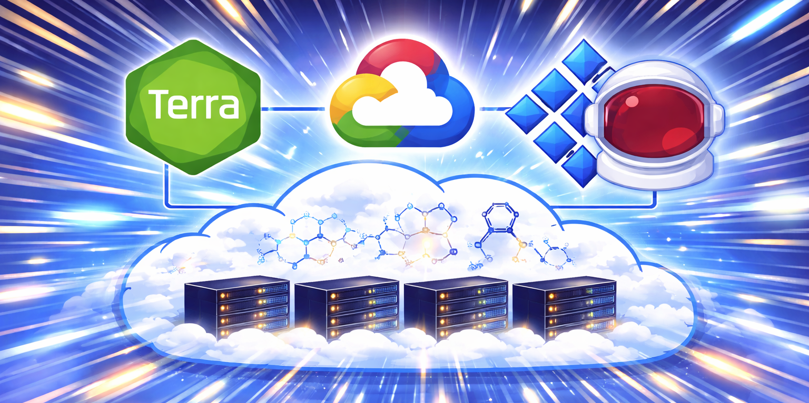
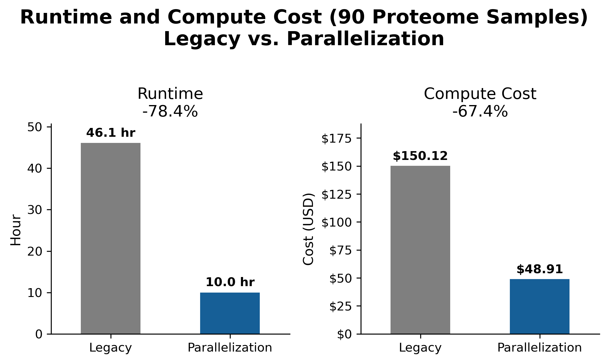
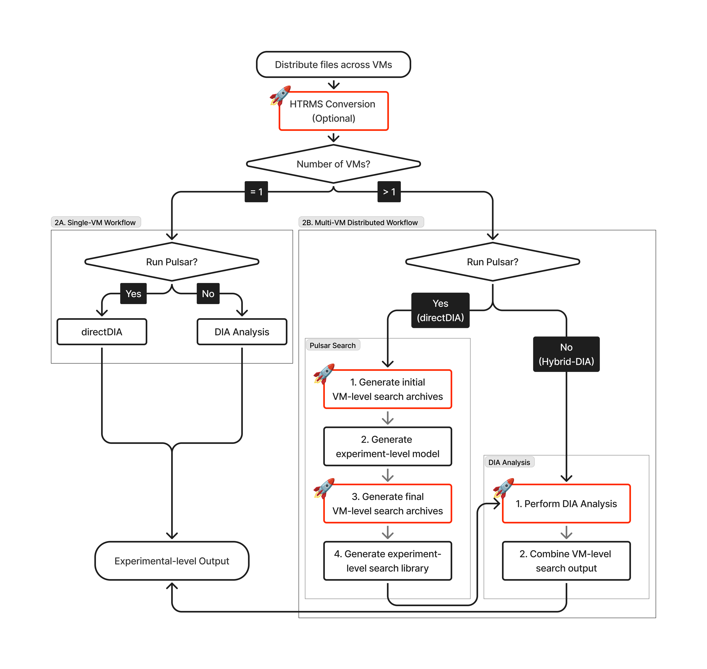
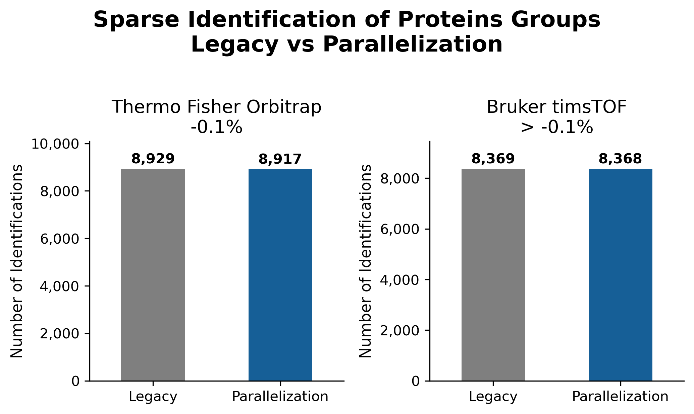
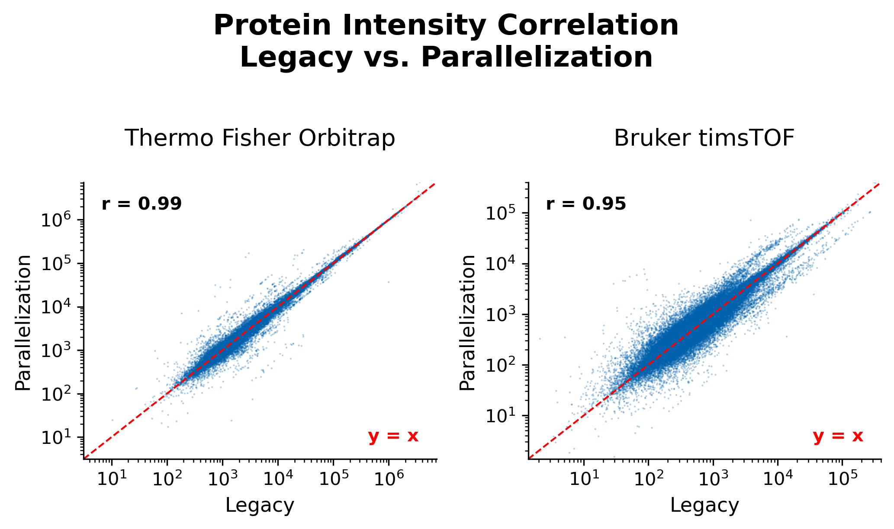

# Parallelized Workflow for Spectronaut DIA Proteomics Analysis



- [:crystal\_ball: Overview](#crystal_ball-overview)
  - [:sparkles: Key Features](#sparkles-key-features)
  - [:mag: How Does Parallelization Work?](#mag-how-does-parallelization-work)
- [:rocket: Getting Started](#rocket-getting-started)
  - [1. Prerequisites \& Environment](#1-prerequisites--environment)
  - [2. File Preparation \& Upload](#2-file-preparation--upload)
  - [3. Execution \& Output](#3-execution--output)
- [:bookmark\_tabs: Input Variables](#bookmark_tabs-input-variables)
  - [1. Core Search Inputs](#1-core-search-inputs)
  - [2. HTRMS Conversion](#2-htrms-conversion)
  - [3. Hybrid-DIA Search](#3-hybrid-dia-search)
  - [Resource \& Performance](#resource--performance)
  - [Preemptible Instance](#preemptible-instance)
- [:bar\_chart: Benchmarking](#bar_chart-benchmarking)
- [:wrench: Troubleshooting](#wrench-troubleshooting)
- [:file\_folder: Useful Resources](#file_folder-useful-resources)
- [:phone: Contacts](#phone-contacts)
- [:tada: Credits](#tada-credits)

## :crystal_ball: Overview

Spectronaut is the primary software platform that we use for data-independent acquisition (DIA) proteomics analysis at the Proteomics Platform. Conventional Spectronaut workflows process samples sequentially on a single compute node, creating a critical throughput bottleneck that limits the scalability in large-scale studies. Although Biognosys has proposed a conceptual framework, a production-ready, fully validated implementation has not previously existed. To address this gap, we developed a cloud-native workflow that distributes analysis across virtual machines (VMs) on Google Cloud Platformat (GCP) via [Terra](https://terra.bio/). 

**This implementation achieves >20x runtime improvement while simultaneously driving down compute costs.**

|                                                                                                                                                                                                       |
| ----------------------------------------------------------------------------------------------------------------------------------------------------------------------------------------------------------------------------------------------------------------------------- |
| **Comparison of runtime and compute cost.** Processing a dataset of 90 proteome samples acquired on a Thermo Fisher Orbitrap Astral Mass Spectrometer, the parallelized workflow demonstrates a 78.4% reduction in total runtime alongside a 67.4% reduction in compute cost. |

### :sparkles: Key Features

#### Performance & Scalability 

- **Robust Parallelization Framework:** Implements the two-step Pulsar framework (Spectronaut v20.3+), eliminating batch-dependent variability by generating a spectral library using aggregated information from all samples.
- **Flexible Scaling:** Set `num_vms` to match your Spectronaut token budget, and the workflow will scale dynamically to your available resources.
- **Parallelized HTRMS Conversion:** Accelerates HTRMS conversion by distributing one file per VM
- **Auto-Resource Tuning:** Dynamically allocates CPU, RAM, and disk space based on input size, preventing resource overhead and reducing configuration burden for users with limited computational experience

#### Scientific Versatility

- **Comprehensive DIA Support:** Automatically switches between directDIA, hybrid-DIA, and library-based DIA modes according to user preference.
- **Fully Customizable:** Provides granular access to Spectronaut search parameters to tailor the analysis to your experimental needs.
- **Proven Reliability:** Validated against the legacy workflow to ensure consistent identification and quantification performance. See [Benchmarking](#bar_chart-benchmarking) for details.

#### Additional Features

- **Cost-Efficient Computing:** Support for [Preemptible Instances](https://cloud.google.com/compute/docs/instances/preemptible) and [Call Caching](https://support.terra.bio/hc/en-us/articles/360047664872-Call-caching-How-it-works-and-when-to-use-it) drives down compute cost and enables restarting a failed run from the exact point of failure.
- **Verbose Logging:** Streamlines troubleshooting experience.
- **Backward Compatible:** Seamlessly reverts to the legacy pipeline when `num_vms = 1`.

### :mag: How Does Parallelization Work?

|                                                                                                                                                                                                                                                                     |
| ------------------------------------------------------------------------------------------------------------------------------------------------------------------------------------------------------------------------------------------------------------------------------------------------------------- |
| **Flowchart of the parallelized workflow.** The workflow executes parallelization by default (Pipeline 2B), while providing backward support for the legacy pipeline (2A). A two-step framework in Pulsar search is adopted in parallelization. Tasks highlighted in red are executed in parallel across VMs. |

## :rocket: Getting Started

### 1. Prerequisites & Environment

1. **Set Up Terra:**
   1. **Sign In:** Go to [Terra](https://app.terra.bio). New to Terra? Register [here](https://support.terra.bio/hc/en-us/articles/360028235911-How-to-register-on-Terra-Google-SSO).
   2. **Create Workspace:** Click **Workspaces** &rarr; **"+"**. Assign a name and billing project. See [Working with Terra workspaces](https://support.terra.bio/hc/en-us/articles/360024743371-Working-with-workspaces) for details.

2. **Create Docker Image:**
   1. Adapt the templated [Dockerfile](src/docker/panoply_spectronaut.dockerfile) for your desired Spectronaut version according to its instructions, then build and push the image to a registry, such as [Docker Hub](https://docs.docker.com/docker-hub/quickstart/#step-3-build-and-push-an-image-to-docker-hub) or [Google Cloud Registry](https://docs.cloud.google.com/artifact-registry/docs/docker). 
      1. If you are new to Docker, check out this [step-by-step guide](https://docs.docker.com/get-started/introduction/build-and-push-first-image/).
   2. **Update Workflow:** In the [WDL file](wdl_workflow/parallelized_search/parallel_spectronaut.wdl), replace the existing `docker` path with your new image path: `docker: "your-registry/your-spectronaut-image:tag"`.
   3. **Import Workflow:** Go to **Library** &rarr; **Workflows** &rarr; **Terra Workflow Repository**. Select **"Create New Workflow"** and upload your updated [workflow file](wdl_workflow/parallelized_search/parallel_spectronaut.wdl). See [Create, edit, and share a new workflow](https://support.terra.bio/hc/en-us/articles/360031366091-Create-edit-and-share-a-new-workflow) for more details.

3. **Set Up `gcloud` CLI:**
   1. **Install:** Follow the [gcloud CLI Installation Guide](https://cloud.google.com/sdk/docs/install). 
   2. **Initialize:** Open your terminal and run:

      ```bash
      gcloud init
      ```

   3. **Authenticate:** Log in using your **Terra-linked Google account**:

      ```bash
      gcloud auth login
      ```

### 2. File Preparation & Upload

1. **Gather Input Files:** Ensure all necessary inputs (see [Input Variables](#bookmark_tabs-input-variables)) are ready for upload.
2. **Upload Files to Terra Workspace:**
   1. **Find Your Workspace GCS Bucket:** In the **Cloud Information** box of your workspace **Dashboard**, copy the path to its GCS bucket.
   2. **Upload Data:** Upload your files to the GCS bucket using the following commands:

      - **For a single file:**

        ```bash
        gcloud storage cp "/path/to/file" "gs://fc-your-bucket/destination/directory/"
        ```

      - **For a folder:**

        ```bash
        gcloud storage cp -r "/path/to/folder/" "gs://fc-your-bucket/destination/folder/"
        ```

        > **Important:** The workflow expects the MS data directory to contain only the raw files intended for search. To prevent execution errors, do not include logs, reports, or other file formats in this folder.

See [How to move data to/from a Google bucket](https://support.terra.bio/hc/en-us/articles/4409101169051-How-to-move-data-to-from-a-Google-bucket) & [gcloud CLI cheat sheet](https://docs.cloud.google.com/sdk/docs/cheatsheet) for additional information.

### 3. Execution & Output

1. **Configure & Launch:**
   1. Open your workflow in the **Workflows** tab.
   2. Check **"Use call caching"** to ensure failed runs restart at the point of failure (optional but **highly recommended**).
   3. Provide the necessary inputs and click **Save** &rarr; **Launch**.
2. **Completion:** Terra will send an email notification once the analysis is complete.
3. **Download Spectronaut Output:** From the **Submission** page, you can [access the execution directory](https://support.terra.bio/hc/en-us/articles/360037096272-Submission-History-overview-monitoring-workflows#h_01G77NZN27609NJET0H13NVY6F:~:text=for%20each%20sample.-,Task%2Dlevel%20details%20(Job%20Manager%20or%20Workflow%20Dashboard),-From%20the%20submission), where you can find the following key Spectronaut outputs:

   |                Output                 |                          Path                          |
   | ------------------------------------- | ------------------------------------------------------ |
   | **Final Outputs and Reports**         | `call-combine_sne/spectronaut_output.zip`              |
   | **Experiment-Level Spectral Library** | `call-combine_final_archives/merged_library.kit`       |
   | **HTRMS-Converted Files**             | Locate within `call-htrms_conversion/` subdirectories. |

#### **:outbox_tray: Copying HTRMS files to local or GCS bucket**

If you converted your data to HTRMS and need to move them to a local directory or another GCS bucket, run:

```bash
gcloud storage cp -r "gs://fc-your-bucket/submissions/YOUR-JOB-ID/call-htrms_conversion/**.htrms" "/path/to/destination/"
```

## :bookmark_tabs: Input Variables

> **Important:** All input GCS paths must start with **"gs://..."**. 

### 1. Core Search Inputs

|       Variable        |        Type        |                                                                                             Description                                                                                              |
| --------------------- | :----------------: | ---------------------------------------------------------------------------------------------------------------------------------------------------------------------------------------------------- |
| `num_vms`             |      Integer       | Number of VMs to run in parallel; each VM consumes one license token.<br>Set to `1` for single-VM directDIA mode (See [Parallelization Flowchart: Pipeline 2A](#mag-how-does-parallelization-work)). |
| `experiment_name`     |       String       | Name of the experiment.                                                                                                                                                                              |
| `experiment_type`     |       String       | Accepts `"proteome"` or `"ptm"`; determines CPU and RAM presets (Default: `"proteome"`).                                                                                                             |
| `file_directory`      |       String       | GCS path to the folder containing the input MS files.                                                                                                                                                |
| `directDIA_settings`  |        File        | GCS path to a `*.prop` directDIA settings file.                                                                                                                                                      |
| `fasta_1`             |        File        | GCS path to a `*.fasta` or `*.bgsfasta` database.                                                                                                                                                    |
| `fasta_[2-3]`         | File<br>(Optional) | GCS path to additional protein database.                                                                                                                                                             |
| `report_schema_[1–4]` | File<br>(Optional) | GCS path to a `*.rs` report schema.                                                                                                                                                                  |
| `enzyme_database`     | File<br>(Optional) | GCS path to a custom enzyme database for non-standard proteolytic enzymes.                                                                                                                           |
| `condition_setup`     | File<br>(Optional) | GCS path to a `*.tsv` condition setup file ([template](docs/spectronaut_condition_setup_template.tsv)).                                                                                               |
| `json_settings`       | File<br>(Optional) | GCS path to a `*.json` file to override Spectronaut search settings.                                                                                                                                 |

### 2. HTRMS Conversion

HTRMS conversion is **highly recommended** for Bruker timsTOF files (`*.d/`) to reduce analysis cost and improve analytic performance, but it is ***not* recommended** on Thermo Fisher Orbitrap files (`*.raw`).

|     Variable     |         Type          |                          Description                           |
| ---------------- | :-------------------: | -------------------------------------------------------------- |
| `do_conversion`  | Boolean<br>(Optional) | Controls execution of HTRMS conversion (Default: `false`).     |
| `convert_schema` |  File<br>(Optional)   | GCS path to a `*.prop` conversion schema from HTRMS Converter. |

### 3. Hybrid-DIA Search

|         Variable         |         Type          |                                      Description                                       |
| ------------------------ | :-------------------: | -------------------------------------------------------------------------------------- |
| `do_pulsar`              | Boolean<br>(Optional) | Controls execution of Pulsar Search (Default: `true`).                                 |
| `spectral_library_[1-3]` | String<br>(Optional)  | GCS path to a pre-built spectral library (`*.kit`). Required when `do_pulsar = false`. |

> **:small_red_triangle_down: Important:** 
> 
> - When `do_pulsar = false`, at least one spectral library must be provided for a standard library-based DIA analysis. 
> - When `do_pulsar = true` and a spectral library is provided, the workflow will run hybrid-DIA analysis using the provided library **and** an *in silico* library generated via Pulsar Search.

### Resource & Performance 

|              Variable              |         Type          | Default |                                                                                               Description                                                                                               |
| ---------------------------------- | :-------------------: | :-----: | ------------------------------------------------------------------------------------------------------------------------------------------------------------------------------------------------------- |
| `generate_sne_large_experiment`    | Boolean<br>(Optional) | `true`  | Selects the SNE combine mode. `true` runs the full `manageSNE --merge` (generates the final merged `*.sne` with reports); `false` runs the lighter `spectronaut combine`. Set to `false` for large experiments (N > 300 samples), where the full merge may exceed available memory and disk. (The name reads backwards: `true` is the heavier merge, not a large-experiment mode.) |
| `average_file_size_gb`             |  Float<br>(Optional)  |  `20`   | Estimated average input file size in GB; only used when `do_conversion = false`.                                                                                                                        |
| `disk_size_multiplier`             |  Float<br>(Optional)  |   `3`   | Multiplier applied to total input size for disk allocation across most tasks. Increase if tasks run out of disk space.                                                                                  |
| `sne_combine_disk_size_multiplier` |  Float<br>(Optional)  |   `6`   | Disk multiplier for the final `sne_combine` step only. Increase if the task runs out of disk space.                                                                                                     |

> **Important:** When `generate_sne_large_experiment = false`, at least one `*.rs` report schema must be provided to obtain analysis results. 
> After the search is complete, `sne_combine` must be re-run on all VM-level `*.sne` files to generate additional reports — you can find a standalone `sne_combine` workflow [here](wdl_workflow/spectronaut_modules/sne_combine.wdl). 

### Preemptible Instance

The `n_preemptible_*` variables control the number of attempts on preemptible VMs before falling back to Standard instances. Set to `0` to always use Standard instances.

|              Variable               |         Type          | Default |
| ----------------------------------- | :-------------------: | :-----: |
| `n_preemptible_htrms_conversion`    | Integer<br>(Optional) |   `2`   |
| `n_preemptible_pulsar_step1`        | Integer<br>(Optional) |   `1`   |
| `n_preemptible_pulsar_step2`        | Integer<br>(Optional) |   `0`   |
| `n_preemptible_pulsar_step3`        | Integer<br>(Optional) |   `1`   |
| `n_preemptible_combine_archives`    | Integer<br>(Optional) |   `0`   |
| `n_preemptible_dia_analysis`        | Integer<br>(Optional) |   `1`   |
| `n_preemptible_combine_sne`         | Integer<br>(Optional) |   `0`   |
| `n_preemptible_directDIA_single_vm` | Integer<br>(Optional) |   `0`   |

## :bar_chart: Benchmarking

The parallelized workflow has undergone rigorous validation using data acquired from both Thermo Fisher Orbitrap and Bruker timsTOF instrument platforms. Benchmarking against the legacy workflow, the parallelized workflow demonstrated exceptional consistency in both protein identification and quantification performance. 

|                                                                                                                                                                                                                                                                                                                           |
| -------------------------------------------------------------------------------------------------------------------------------------------------------------------------------------------------------------------------------------------------------------------------------------------------------------------------------------------------------------------------------------------- |
|                                                                                                                                                                                                                                                                                                                           |
| **Comparison of protein group identification and quantification between the legacy and parallelized workflows.** Processing a benchmark dataset of 10 standard Jurkat QC samples acquired on Thermo Fisher Orbitrap Astral and Bruker timsTOF HT mass spectrometers, respectively, the parallelized workflow demonstrates exceptional consistency in both identification and quantification. |

## :wrench: Troubleshooting

Before you start, run through this checklist before submitting your job — it covers the most common causes of failure:

- [ ] All raw input files are in a **single GCS folder** (not nested in subfolders)
- [ ] FASTA file is in standard `.fasta` or `.bgsfasta` format and is accessible from your Terra workspace
- [ ] The `.prop` settings file was exported from the **same version** of Spectronaut supported by this workflow
- [ ] `experiment_type` is entered exactly as `"proteome"` or `"ptm"` (all lowercase, no spaces)
- [ ] If `do_pulsar = false`, at least one `spectral_library_*` input is provided
- [ ] **"Use call caching"** is checked in the workflow configuration page
- [ ] You are authenticated with the correct Broad Google account (`gcloud auth login`)

**I got an error about insufficient disk space.**
Increase the `disk_size_multiplier` input (e.g., from `3` to `4` or `5`). If the error was in the SNE combine step specifically, increase `sne_combine_disk_size_multiplier`.

**I got a permission error when uploading files — "You do not have access to this bucket".**
Re-authenticate your machine with your Broad Google account using `gcloud auth login`. This is the most common cause: another user previously signed in on the same computer, and their credentials are being used instead of yours. See the [gcloud CLI setup steps](#1-prerequisites--environment) above for details.

**I'm not sure how many VMs to use.**
A reasonable starting point is one VM per 20–30 files. For 200 files, `num_vms = 8` or `num_vms = 10` works well. The workflow will not create more VMs than you have files — if you request 20 VMs for 15 files, it will automatically scale down to 15 VMs.

**I set `do_pulsar = false` but my job failed immediately with an error about spectral libraries.**
When `do_pulsar = false`, you must provide at least one spectral library via `spectral_library_1` (and optionally `spectral_library_2`, `spectral_library_3`). The workflow validates this at startup and exits early if no library is supplied.

## :file_folder: Useful Resources

- [Spectronaut Manual](https://biognosys.com/resources/spectronaut-manual/)
- [Running Spectronaut on a Public Dataset in a Distributed Manner (Spectronaut v20.3+)](docs/biognosys/20251203_Distributed_Processing_Spectronaut_20_v2.0.pdf)

## :phone: Contacts

- **Cameron Lian** (<glian@broadinstitute.org>)
  Research Associate I, Proteomics Platform
- **‌Natalie Clark** (<nclark@broadinstitute.org>)
  Senior Computational Scientist I, Proteomics Platform
- **DR Mani** (<manidr@broadinstitute.org>)
  Director, Computational Proteomics

## :tada: Credits 

- **Moe Haines**
  Research Scientist I, Proteomics Platform